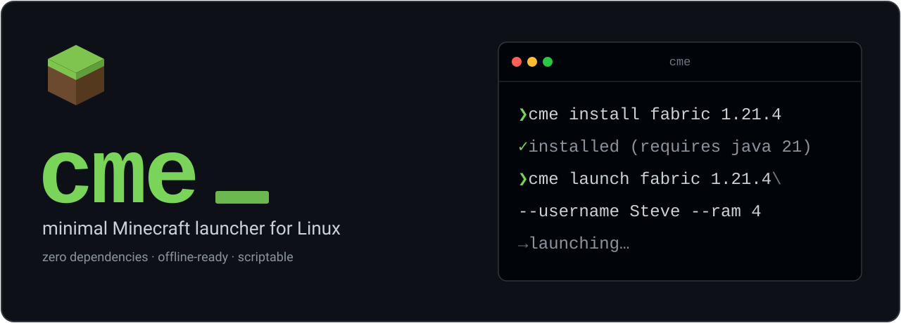

<p align="center">
  
</p>

<p align="center">
  <a href="LICENSE"></a>
  
  
  
  <a href="https://github.com/onceprgm/cme/releases"></a>
</p>

<p align="center">
  <b>A zero-dependency command-line Minecraft launcher for Linux.</b><br>
  Installs and launches vanilla, Fabric and Quilt in offline mode — no GUI, no Electron, no runtime deps.
</p>

<p align="center">
  <a href="#quick-start">Quick&nbsp;start</a> &nbsp;·&nbsp;
  <a href="#why-cme">Why</a> &nbsp;·&nbsp;
  <a href="#usage">Usage</a> &nbsp;·&nbsp;
  <a href="#version-support">Support</a> &nbsp;·&nbsp;
  <a href="#file-layout">Layout</a> &nbsp;·&nbsp;
  <a href="#roadmap">Roadmap</a>
</p>

> [!NOTE]
> **Alpha (`0.1.1-alpha`).** Installing and launching work. Accounts are
> offline-only. Linux x86_64 is the only tested platform.

---

## Quick start

```sh
# build it (or grab a binary from the Releases page)
go build -o cme ./cmd/cme

# vanilla
cme install 1.20.1
cme launch 1.20.1 --username Steve --ram 4

# with Fabric (vanilla base is installed automatically)
cme install fabric 1.21.4
cme launch fabric 1.21.4 --username Steve --ram 4
```

## Why cme

- **Zero dependencies** &mdash; a single static Go binary, nothing to install beside it.
- **Verified downloads** &mdash; every file checked by SHA-1 *and* size, in parallel, with retry.
- **Offline-first** &mdash; deterministic offline UUID; the version list is cached and keeps working without a network.
- **Fabric, Quilt &amp; NeoForge** &mdash; `cme install fabric <version>` (or `quilt` / `neoforge`), merged against the vanilla base at launch. Classic Forge is on the roadmap.
- **Scriptable** &mdash; data on stdout, progress on stderr, nothing that blocks a pipe.
- **XDG-clean** &mdash; data, cache and state land where they belong; each version gets its own instance directory.

## Usage

```sh
# list versions (filter by type)
cme version list
cme version list --release        # or --snapshot | --old-beta | --old-alpha

# install: client JAR + libraries + natives + assets, verified by SHA-1 and size
cme install 1.20.1

# install a matching Java runtime (Temurin JRE) if you don't already have one
cme java install 21

# install with Fabric, Quilt or NeoForge (latest loader by default, or pin one)
cme install fabric 1.21.4
cme install quilt 1.21.4
cme install neoforge 1.21.1
cme install fabric 1.21.4 0.16.9

# launch in offline mode
cme launch 1.20.1 --username Steve
cme launch 1.20.1 --username Steve --ram 4
cme launch fabric 1.21.4 --username Steve --ram 4
cme launch quilt 1.21.4 --username Steve --ram 4
cme launch neoforge 1.21.1 --username Steve --ram 4
cme launch 1.20.1 --username Steve --jvm-arg -XX:+UseG1GC   # repeatable

# verify an install and re-download only corrupt or missing files
cme verify 1.20.1
```

`--ram` is in gigabytes and sets both `-Xmx` and `-Xms`. The offline UUID is
derived deterministically from the username, so it stays consistent across
sessions and matches what a server computes for the same name. `--jvm-arg`
passes one extra JVM argument and may be repeated.

> [!TIP]
> Pass `-v` (or `--debug`, or set `CME_DEBUG=1`) to mirror the detailed launcher
> log to stderr. Either way the full log is always written to
> `~/.local/state/cme/cme.log` &mdash; the first place to look when a launch fails.

The version list is cached, so `cme version list` keeps working offline after
the first run.

<details>
<summary>Sample output</summary>

```
* 26.2-rc-1                  snapshot   2026-06-11
  26.2-pre-6                 snapshot   2026-06-10
  26.2-pre-5                 snapshot   2026-06-08
  ...
* 26.1.2                     release    2026-04-09
  ...
  rd-132328                  old_alpha  2009-05-13
```

`*` marks the latest release or snapshot.

</details>

### Profiles

Save a version, loader, account and JVM settings under a name and launch with a
single command. Each profile gets its own game directory, so saves, mods and
options stay separate.

```sh
cme config set username Steve              # global default, used everywhere
cme profile create modpack fabric 1.21.4 --ram 6
cme run modpack
cme profile list
```

Run `cme profile create <name>` with no version in a terminal to fill it in
interactively. Fields left unset on a profile fall back to `cme config`.

## Version support

| Versions          | Status                                             |
|-------------------|----------------------------------------------------|
| 1.7.3 and newer   | Fully supported                                    |
| 1.6.x and older   | Launches, but sound and languages may be missing¹  |

<sub>¹ These use the legacy asset layout, which isn't implemented yet (planned).</sub>

## File layout

`cme` follows the XDG Base Directory spec:

```
~/.local/share/cme/
  versions/<id>/      version JSON, client JAR, extracted natives
  libraries/          shared across versions
  assets/             shared across versions
  instances/<id>/     per-version game directory (saves, logs, options)
~/.cache/cme/
  version_manifest_v2.json   cached version manifest (offline fallback)
~/.local/state/cme/
  cme.log             launcher diagnostic log (last run)
```

<details>
<summary>Requirements</summary>

- Linux (x86_64; ARM is untested)
- [Go](https://golang.org) 1.22+ to build
- A Java runtime matching the version you want to play (Java 8 for old versions,
  17 for 1.18–1.20, 21 for 1.20.5+). `cme` finds Java in your `PATH` or
  `/usr/lib/jvm`, or fetches a Temurin JRE for you with `cme java install <major>`.

Prebuilt Linux x86_64 binaries are on the
[Releases](https://github.com/onceprgm/cme/releases) page.

</details>

## Roadmap

- [x] fetch and parse the version manifest
- [x] install vanilla versions (client, libraries, natives, assets — SHA-1 and size verified)
- [x] parallel downloads with retry and resume-by-hash
- [x] launch installed versions in offline mode
- [x] diagnostic log and `-v`/`--debug`
- [x] Fabric and Quilt
- [x] integrity check (`cme verify`)
- [x] automatic Java installation
- [x] profiles and config file
- [x] NeoForge
- [ ] classic Forge
- [ ] legacy asset layout (sound for pre-1.9 versions)

## Development

Everything through `0.1.0-alpha` was written by hand. From `0.1.1-alpha` onward
(diagnostic logging, manifest caching, Fabric loader support) development has
been done with the assistance of AI (Claude Code).

---

<p align="center">
  <sub><a href="LICENSE">MIT</a> &nbsp;·&nbsp; built for the terminal, not the mouse</sub>
</p>
